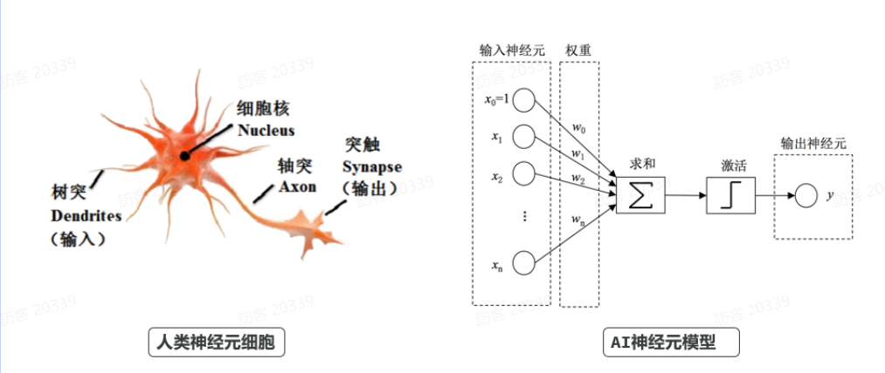
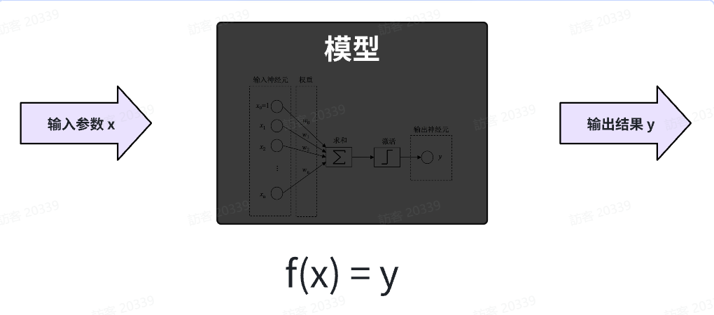
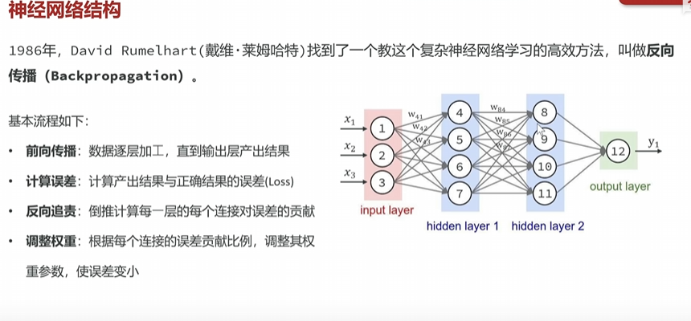

2022年，GPT3刚刚发布时，AI的智商大约相当于7岁的小朋友，而如今最先进的大模型，其智商已接近20岁的成年人，甚至在某些领域比人类更加智能。

那么，大模型的"智能"为什么发展如此迅速？大模型产生"智慧"的根本原因是什么呢？

影响大模型智能的核心要素有三点：

- 模型算法
- 海量数据
- 超级算力

### 模型算法

首先是模型算法，现在的AI都是采用**神经网络**架构，你可以把它看做是AI的大脑，是决定AI是否”聪明”的基础。

人类的大脑是由很多**神经元细胞**构成，AI**神经网络**的本质就是在模拟人类大脑神经元：



AI的神经元与人类神经元一样，接收多个不同的输入x，经过加权求和得到初步结果，再通过激活函数处理生成最终的输出结果。但由于早期的激活函数比较简单，只能做一些简单的二分类任务，比如判断性别、判断真假。




这就类似：y = ax + b，这个函数有两个参数a和b，当a和b确定时，这个函数就能表示一条直线。输入一个x，一定能得到一个结果y

当然，模型这个“函数”要复杂的多，其参数不是两个，而是可能达到千亿规模：

### 反向传播



**前向传播（Forward）**

```
x → 网络 → 预测值 ŷ
```

------

**计算误差（Loss）**

```
ŷ 和 y（真实值）之间的差距
```

------

**反向传播（重点）**

👉 从输出层开始：

```
误差 → 往前一层传 → 再往前 → 一直到输入层
```

每一层都会得到：

👉 “我该怎么改自己的参数”

------

**更新参数**

```
W = W - 学习率 × 梯度
```