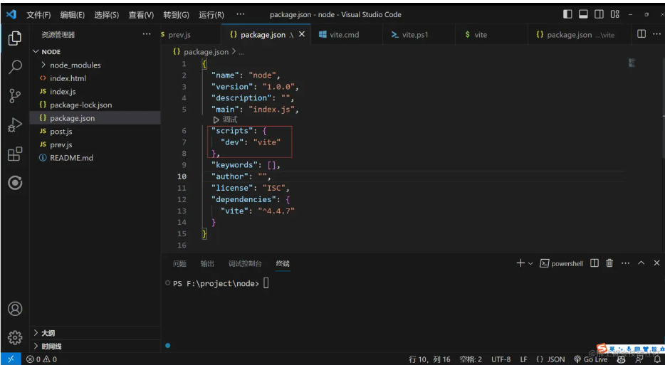
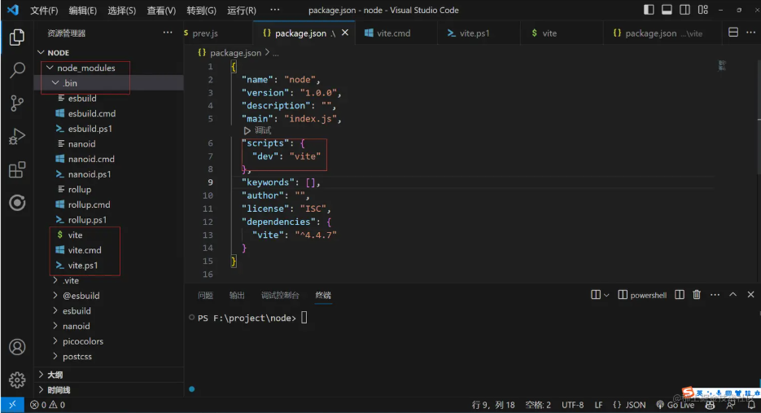
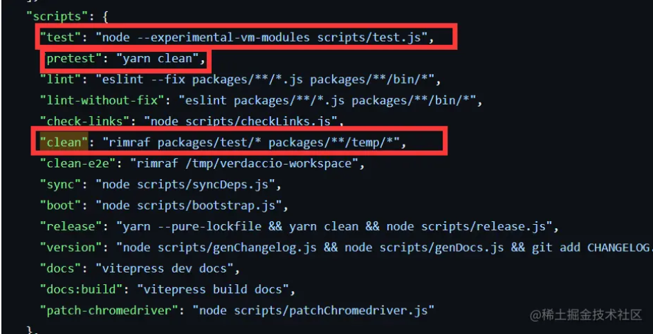

### npm run xxx 发生了什么

按照下面的例子npm run dev 举例过程中发生了什么



读取package json 的scripts 对应的脚本命令(dev:vite),vite是个可执行脚本，他的查找规则是：

- 先从当前项目的node_modules/.bin去查找可执行命令vite
- 如果没找到就去全局的node_modules 去找可执行命令vite
- 如果还没找到就去环境变量查找
- 再找不到就进行报错

如果成功找到会发现有三个文件



> 因为nodejs 是跨平台的所以可执行命令兼容各个平台

- .sh文件是给Linux unix Macos 使用
- .cmd 给windows的cmd使用
- .ps1 给windows的powerShell 使用


### npm 生命周期

没想到吧npm执行命令也有生命周期！！！

```json
"predev": "node prev.js",
"dev": "node index.js",
"postdev": "node post.js"
```

执行 npm run dev 命令的时候 predev 会自动执行 他的生命周期是在dev之前执行，然后执行dev命令，再然后执行postdev，也就是dev之后执行

运用场景例如npm run build 可以在打包之后删除dist目录等等

post例如你编写完一个工具发布npm，那就可以在之后写一个ci脚本顺便帮你推送到git等等

谁用到了例如vue-cli [github.com/vuejs/vue-c…](https://link.juejin.cn?target=https%3A%2F%2Fgithub.com%2Fvuejs%2Fvue-cli%2Fblob%2Fdev%2Fpackage.json)

