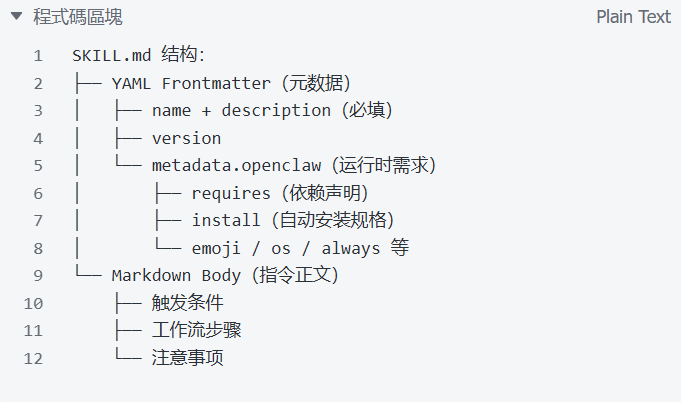
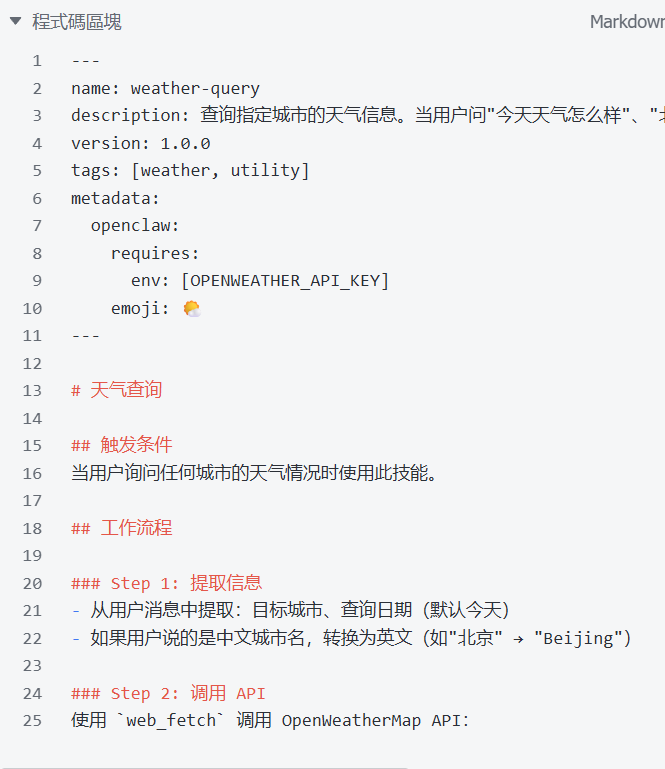
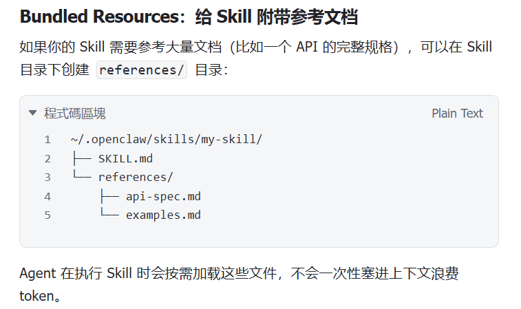
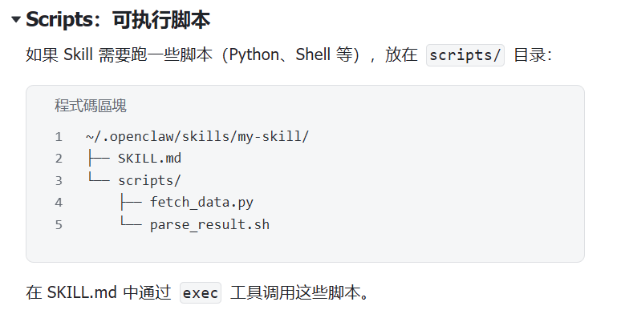

### 如何减少幻觉？

1. 约束上下文，在prompt给出代码示例，贴入使用的库的一些api
2. 

### skill的加载策略

**第一级:工作区 Skills(优先级最高)**
1 <workspace>/skills/
项目专属技能。比如你的工作空间在~/.openclaw/workspace/,那就是 ~/.openclaw/workspace/skills/。
适用场景:只在当前项目中使用的技能。

**第二级:用户 Skills**
1 ~/.openclaw/skills/
跨项目共享的技能。clawhub install 默认安装到这里。
适用场景:所有项目都能用的通用技能,比如搜索、邮件、GitHub 操作。

**第三级:内置Skills(优先级最低)**
OpenClaw 自带的技能,比如 github、memory summarize 等52个。 不需要安装,开箱即用。

### Skill的结构

### LLM和NLP的区别

**① 理解方式：词义 vs. 向量空间**

- **传统 NLP：** 往往基于词典或简单的词向量（如 Word2Vec）。它能知道“猫”和“狗”相似，但很难理解“那个在雨中奔跑的孩子”这种复杂的语义层次。
- **LLM：** 基于 **Transformer 架构**。它通过注意力机制，能计算出句子中每个词与其他所有词的关联强度。它理解的是**上下文（Context）**，而不是孤立的词。

**② 学习范式：有监督 vs. 自监督**

- **传统 NLP：** 需要大量**人工标注**的数据（比如雇人标出一万句话里哪些是“地名”）。
- **LLM：** 采用**自监督学习**。它玩的是“完形填空”——通过阅读无数文章，预测下一个词是什么，从而在这个过程中习得人类世界的逻辑。

**③ 适应性：微调 (Fine-tuning) vs. 提示工程 (Prompt Engineering)**

- **传统 NLP：** 如果你想改变任务，可能得重新训练或大幅微调模型参数。
- **LLM：** 你只需要通过 **Prompt**（提示词）告诉它：“你现在是一个 GIS 专家”，它就能立刻切换工作模式。

### 什么是Agent

**大脑 (Reasoning/Planning)：** 依靠 LLM 进行思维链（CoT）推理，将复杂目标拆解为子任务。

**感知 (Perception)：** 接收外部输入（文字、图像、甚至 GIS 传感器数据）。

**记忆 (Memory)：**

- **短期记忆：** Context 上下文（对话历史）。
- **长期记忆：** 向量数据库（RAG），存储历史经验或专业知识。

**工具箱 (Action/Tools)：** 这是 Agent 区别于普通聊天机器人的关键。它能调用外部 API、运行 Python 脚本或操作浏览器。

### 优化prompt的策略 