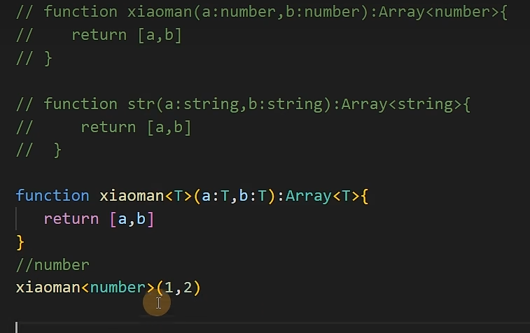

### TypeScript

TypeScript 是 JavaScript 的**超集**。如果把 JS 比作“裸奔”，那么 TS 就是给它穿上了一层“外骨骼装甲”。

- **核心定位**：**静态类型检查**。JS 是在运行时（Runtime）才报错，而 TS 是在编译时（Compile time）就把 Bug 掐死在摇篮里。
- **三大价值**：
  1. **类型安全**：避免 `undefined is not a function`。
  2. **更好的 IDE 体验**：你在写代码时，自动补全会精准告诉你这个对象里有哪些属性，不需要去翻文档。
  3. **重构利器**：改一个接口名，全项目报错，你顺着报错改完就行，不用担心改漏。

###  TS 工具类型 

| **工具类型**       | **作用**                               | **实战场景**                                |
| ------------------ | -------------------------------------- | ------------------------------------------- |
| **`Partial<T>`**   | 将 `T` 中所有属性变为**可选**。        | 更新用户信息时，只传修改的那几个字段。      |
| **`Required<T>`**  | 将 `T` 中所有属性变为**必选**。        | 确保某个配置对象在初始化后必须完整。        |
| **`Readonly<T>`**  | 将所有属性变为**只读**。               | 防止配置文件被意外修改。                    |
| **`Pick<T, K>`**   | 从 `T` 中**挑选**出一部分属性 `K`。    | 比如 User 有 50 个字段，列表页只需要 3 个。 |
| **`Omit<T, K>`**   | 从 `T` 中**剔除**一部分属性 `K`。      | 创建用户时，剔除掉后端生成的 `id`。         |
| **`Record<K, T>`** | 创建一个对象类型，键为 `K`，值为 `T`。 | 定义配置映射，如 `Record<string, User>`。   |

###  Type vs Interface 的区别

| **特性**     | **Interface**                         | **Type**                                   |
| ------------ | ------------------------------------- | ------------------------------------------ |
| **扩展方式** | 使用 `extends` 关键字。               | 使用交叉类型 `&`。                         |
| **声明合并** | **支持**。同名 interface 会自动合并。 | **不支持**。同名会报错。                   |
| **适用范围** | 仅限**对象、函数**。                  | 可以是任意类型（联合类型、元组、原始值）。 |
| **计算属性** | 不支持。                              | 支持（可以使用 `in` 关键字）。             |


### 相比js新增的类型

**1. unknown**

集合上讲是一个类型收敛问题，Any和任何类型的交集还是any，但是 unknown 和任何类型的交集就是你指定的那个类型； 使用场景上解决一个什么问题呢？解决的是你 any 这个类型，一旦定义以后是无法更改的.但是 unknown 可以，有能再做类型收敛的余地。

```
if (typeof b === 'string') {
  b.toUpperCase() // ✅ 现在可以用了
}
```


**2. never **

使用场景：

- 抛异常
- 死循环
- 类型穷尽检查

**3. void**

`void`：可以有返回，但你别用

`undefined`：必须就是 undefined

**4. 联合类型 |   交叉类型**&

**5. typeof增强类型推导**

```
const obj = { name: 'a' }
type T = typeof obj
```

**6. keyof**

```
type T = keyof { a: 1, b: 2 } // 'a' | 'b'
```

### **接口**

interface 用于定义对象结构，支持属性约束、继承等；

### 泛型

泛型用于实现类型的复用，使函数或接口可以适配多种类型，并通过 extends 进行约束，从而在保证灵活性的同时保证类型安全。


下面函数，类型出现重复，泛型就是为了解决函数复用。



