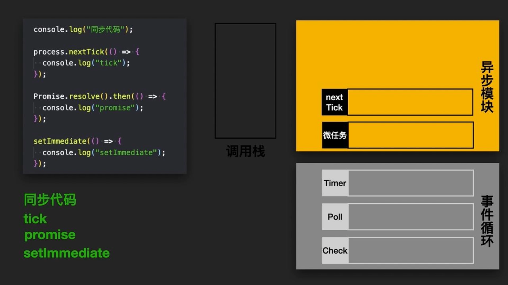

JavaScript 是**单线程**的，意味着它一次只能做一件事。如果没有事件循环，当我们发起一个网络请求时，页面就会“卡死”直到请求完成。

为了解决这个问题，JS 把任务分为：

- **同步任务**：直接在主线程（执行栈）上排队执行。
- **异步任务**：委托给浏览器（或 Node）的其他线程处理，处理完后将回调放入“任务队列”。

### 核心组成

**执行栈 (Call Stack)**：存储正在执行的代码。

**Web APIs**：浏览器提供的功能（定时器、网络请求、DOM 事件）。

**微任务队列 (Microtask Queue)**：存放 Promise 的 `then`、`MutationObserver` 等。

**宏任务队列 (Macrotask Queue)**：存放 `setTimeout`、`setInterval`、`I/O`、UI 渲染等。

### 执行过程

1. **执行同步代码**：从上到下执行，所有同步任务进入执行栈执行，异步任务交给 Web APIs 处理。
2. **清空微任务**：一旦执行栈为空，JS 引擎会**立即**去检查微任务队列。如果有任务，就依次全部执行完，直到微任务队列清空。
3. **执行一个宏任务**：从宏任务队列中取出一个（仅一个）任务放入执行栈执行。
4. **重新开始**：宏任务执行完后，再次检查并清空微任务队列，然后更新 UI 渲染，循环往复。

> **关键点**：微任务的优先级高于宏任务。在两个宏任务之间，必须清空所有的微任务。

**微任务**

- **`Promise.then / .catch / .finally`**: 这是最常见的微任务。
- **`async / await`**: 记住，`await` 后面的代码本质上就是包裹在 `.then` 里的逻辑。
- **`MutationObserver`**: 监听 DOM 树变化的 API。
- **`queueMicrotask()`**: 这是一个专门让你手动开启微任务的原生方法。
- **`process.nextTick` (Node.js 专属)**: 微任务中的“特权阶级”。它不属于事件循环的任何阶段，它会在当前操作完成后、事件循环继续之前立即执行。

**宏任务**

- **`script` (整体代码)**: 你的第一行代码其实就是第一个宏任务。
- **`setTimeout` / `setInterval`**: 定时器兄弟。
- **`setImmediate` (Node.js 专属)**: 类似于 `setTimeout(0)`，但执行时机略有不同。
- **`I/O`**: 比如文件读写、网络请求回调。
- **UI 交互事件**: 比如 `click`、`scroll` 等回调。
- **`MessageChannel`**: 常用于框架底层（如 React 的 Scheduler）模拟宏任务。

### node中和浏览器中的事件循环的不同

**浏览器：** 结构相对简单。主要就是一个**宏任务队列**和一个**微任务队列**。执行完一个宏任务，就去清空所有微任务。

**Node.js：** 它的事件循环是分阶段的，libuv 维护了 **6 个主要阶段**，每个阶段都有自己的回调队列。

**Timers Phase (定时器阶段)**

- **动作：** 检查 `min-heap`（小顶堆）中存储的定时器。
- **内容：** 执行所有已过期的 `setTimeout` 和 `setInterval` 回调

 **Pending Callbacks Phase (待定回调阶段)**

- **动作：** 执行某些系统操作的回调。
- **内容：** 比如 TCP 连接收到 `ECONNREFUSED` 错误，这些错误回调会被推迟到此阶段执行。

**Idle, Prepare Phase (空闲与准备阶段)**

- **动作：** 仅由系统内部使用。
- **内容：** 它是 libuv 内部同步状态的阶段，开发者无法直接干预。

**Poll Phase (轮询阶段) —— 核心引擎**

- **动作：** 检索新的 I/O 事件。
- **内容：**
  - 如果队列不为空，同步执行所有回调。
  - 如果队列为空：
    - 若有 `setImmediate`，则结束 Poll 进入 Check 阶段。
    - 若无 `setImmediate`，线程会**阻塞**在此处等待新事件（或等待定时器到期），从而避免 CPU 空转。

**Check Phase (检查阶段)**

- **动作：** 专门执行 `setImmediate()` 的回调。
- **内容：** 设计此阶段是为了让某些代码在 Poll 阶段完成后立即执行。

**Close Callbacks Phase (关闭回调阶段)**

- **动作：** 执行 `close` 类型的事件。
- **内容：** 比如 `socket.on('close', ...)` 或 `handle.destroy()`。

### process.nextTick

比事件循环的优先级更高，总在事件循环的前面执行。

# settimeout 在node中最小是1ms，浏览器中最小是4ms。