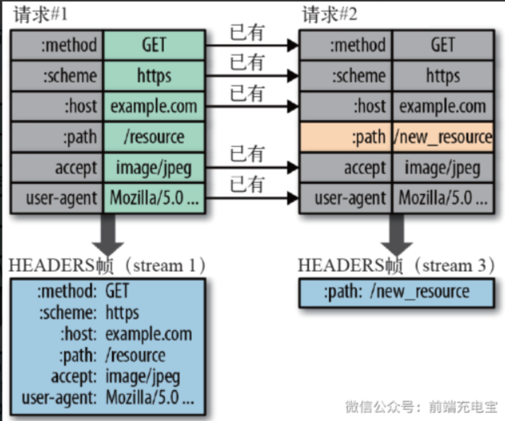
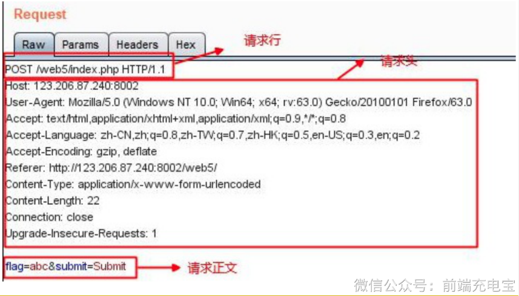
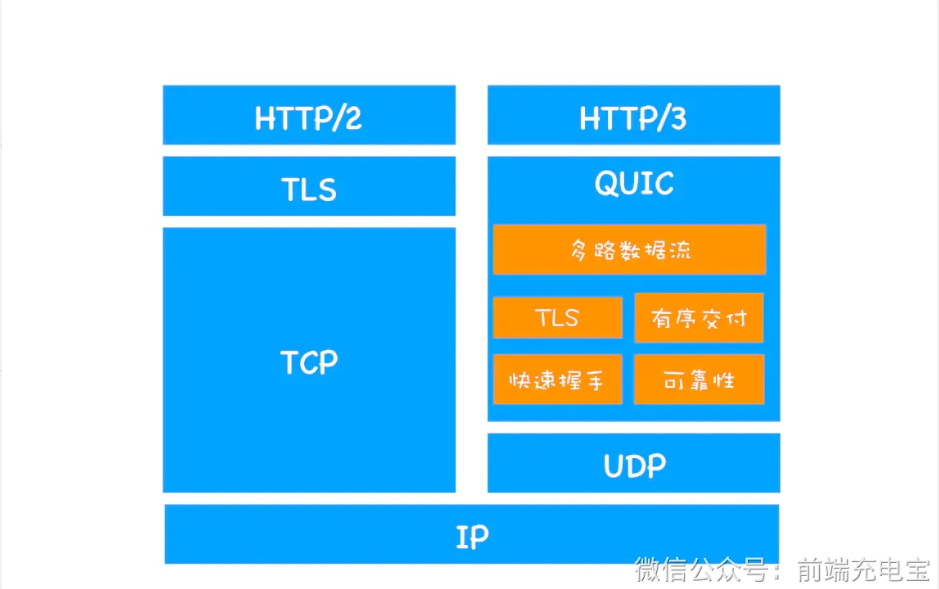
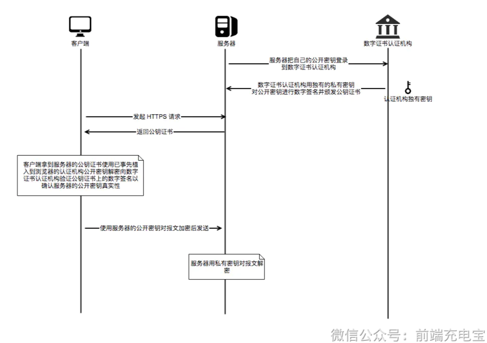

### DNS协议

 DNS 是域名系统 (Domain Name System) 的缩写，提供的是一种主机名到 IP 地址的转换服务，就是我们常说的域名系统。它是一个由分层的 DNS 服务器组成的分布式数据库，是定义了主机如何查询这个分布式数据库的方式的应用层协议。能够使人更方便的访问互联网，而不用去记住能够被机器直接读取的IP数串。

### HTTP版本

#### HTTP/1.0 vs HTTP/1.**1**

1. **连接管理**

- **HTTP/1.0**

- 默认采用非持久连接。
- 每发送一个请求都要建立新的 TCP 连接，响应完成后即关闭连接。

- **HTTP/1.1**

- 默认启用持久连接（Keep-Alive）。
- 通过 `Connection: keep-alive` 控制连接保持，允许在同一 TCP 连接上发送多个请求。
- 连接中请求必须按顺序处理（串行执行），不支持真正的并发请求。
- 浏览器为了提升性能，限制同一域名下最大并发 TCP 连接数为 6~8 个（现代浏览器通常为 6 个）。

------

2. **资源请求**

- **HTTP/1.0**

- 不支持断点续传，客户端只能请求整个资源。
- 下载过程中断时必须重新从头开始下载，造成带宽浪费。

- **HTTP/1.1**

- 引入 `Range` 请求头，允许客户端请求资源的部分字节范围。
- 服务器收到带有 Range 请求时返回状态码 `206 Partial Content`，仅返回指定范围的数据。
- 支持断点续传，大大节省带宽和时间，提高用户体验。

------

3. **缓存机制**

- **HTTP/1.0**

- 主要使用请求头 `If-Modified-Since` 和响应头 `Expires` 控制缓存。
- `If-Modified-Since`：客户端带上资源的最后修改时间，服务器对比决定是否返回资源。**（协商缓存）**
- `Last-Modified`：服务器告诉客户端资源最后修改时间。
- `Expires`：服务器告诉客户端缓存的过期时间，过期前优先使用缓存。**（强缓存）**

- **HTTP/1.1**

- 使用 **ETag** 和更多缓存控制头部。
- `Cache-Control ` : **（强缓存）**
- `ETag`：资源唯一标识（指纹），资源内容变更时 ETag 改变。
- `If-None-Match`：客户端带上缓存资源的 ETag，匹配则返回 `304 Not Modified`。**（协商缓存）**

------

4. **Host 请求头**

- **背景**

- HTTP/1.0 假设每台服务器绑定唯一 IP，客户端请求时不携带主机名。
- 随着虚拟主机技术发展，一台服务器可托管多个网站。

- **问题**

- HTTP/1.0 请求没有主机名字段，服务器无法区分请求目标虚拟主机。

- **解决方案（HTTP/1.1）**

- 引入 `Host` 请求头，客户端必须携带目标服务器域名。
- 服务器根据 `Host` 字段路由请求，实现多个网站共享同一 IP。

- **示例请求**

```plain
http


复制编辑
GET /index.html HTTP/1.1
Host: www.example.com
```

------

**5. 管道化（Pipelining）**

- **HTTP/1.1** 的性能优化技术。
- 客户端可以一次性发出多个请求，无需等待前一个响应。
- 服务器按顺序处理请求并返回响应，提高连接效率。

------

#### HTTP/1.1 vs HTTP/2

**1. 传输格式：文本 vs 二进制 (The Core Change)**

这是 H2 性能提升的基石。

- **HTTP/1.1 (文本协议)：** 报文由 Header（文本）和 Body（文本或二进制）组成，中间用换行符分割。
  - **缺点：** 计算机解析文本效率低，且文本存在歧义（如换行符处理），健壮性差。
- **HTTP/2 (二进制分帧)：** 将所有传输信息分割为更小的**帧（Frame）**，并采用二进制格式编码。
  - **帧与流：** 头部信息被封装在 `HEADERS frame` 中，数据封装在 `DATA frame` 中。这些帧组合成一个逻辑上的“流（Stream）”。
  - **优势：** 二进制解析更快、更紧凑，错误率更低。

------

**2. 多路复用：彻底解决队头阻塞 (Multiplexing)**

这是 H2 最著名的特性。

- **HTTP/1.1 (队头阻塞 HOLB)：**
  - 虽然支持长连接，但在同一个 TCP 连接里，请求必须是**串行**的。
  - 如果第一个请求（如大图）卡住了，后面的请求（如关键 CSS）必须排队等死。
  - **老土的优化手段：** 以前我们会用“域名收敛”（开 6 个子域名并行下载）或“精灵图（Sprite）”来规避这个问题。
- **HTTP/2 (多路复用)：**
  - 在同一个 TCP 连接上，客户端可以**同时**发出无数个请求，服务器也可以**并行**返回响应。
  - 不同请求的“帧”混杂在一起传输，通过帧头部的 **Stream ID** 来标识属于哪个请求。
  - **结果：** 真正实现了单连接下的全双工通信，彻底消除了应用层的队头阻塞。

------

**3. 头部压缩：告别冗余 (HPACK)**

HTTP 是无状态的，这意味着每次请求都要带上相同的 Header。

- **HTTP/1.1 (重复传输)：** 每次请求都要携带 `User-Agent`、`Cookie`、`Accept` 等几百甚至上千字节的文本。在一个有 100 个请求的页面里，光 Header 就要浪费几十 KB 的带宽。
- **HTTP/2 (HPACK 算法)：**
  - **静态表：** 预定义了 61 个高频字段（如 `GET`、`200` 等），只用一个数字索引表示。
  - **动态表：** 通信双方共同维护一张表。如果第一次发了完整的 `User-Agent`，第二次只需发个索引号，或者只发送“增量”部分。
  - **Huffman 编码：** 对字符串进行哈希压缩。
  - **效果：** Header 的体积通常能减少 **80% - 90%**。

------

**4. 服务器推送 (Server Push)**

- **HTTP/1.1 (被动)：** 浏览器解析完 HTML，发现里面有 `style.css`，再去发请求问服务器要。
- **HTTP/2 (主动)：** 服务器“预判”了你的预判。当你请求 `index.html` 时，服务器知道你肯定需要 CSS 和 JS，于是直接把这些资源顺着连接推送到浏览器的缓存里。
  - **优势：** 减少了等待浏览器解析 HTML 并重新发起请求的 RTT（往返时间）。

------

**5. 请求优先级 (Stream Priority)**

由于 H2 是多路复用的，如果所有资源一起抢占带宽，可能会导致关键的 CSS 还没下完，无关紧要的图片先下好了。

- **HTTP/2：** 允许客户端给每个“流”设置权重和依赖关系。浏览器会告诉服务器：“优先给我发这个 JS 脚本，图片可以慢慢传”。服务器会根据优先级分配带宽资源。

### HTTP协议

HTTP 是一种应用层协议，用于在客户端和服务器之间传输超文本资源。它采用请求-响应模型进行通信，具有无状态的特点。HTTP 定义了请求和响应的消息格式，例如请求行、请求头、请求体和状态行、响应头、响应体。HTTP 本身不负责数据传输，而是基于 TCP 等传输层协议实现可靠的数据传输。

### HTTPS协议

HTTPS 是在 HTTP 协议之上加入 TLS 加密层形成的安全通信协议。HTTPS 通过 TLS 握手建立安全连接，并使用非对称加密交换密钥，再通过对称加密进行数据传输。同时通过数字证书验证服务器身份，并通过加密和完整性校验机制保证数据的机密性和完整性，从而防止数据被窃听、篡改或伪造。

### GET方法限制URL的原因

实际上HTTP协议规范并没有对get方法请求的url长度进行限制，这个限制是特定的浏览器及服务器对它的限制。

IE对URL长度的限制是2083字节(2K+35)。由于IE浏览器对URL长度的允许值是最小的，所以开发过程中，只要URL不超过2083字节，那么在所有浏览器中工作都不会有问题。

```javascript
GET的长度值 = URL（2083）- （你的Domain+Path）-2（2是get请求中?=两个字符的长度）
```

下面看一下主流浏览器对get方法中url的长度限制范围：

- Microsoft Internet Explorer (Browser)：IE浏览器对URL的最大限制为2083个字符，如果超过这个数字，提交按钮没有任何反应。
- Firefox (Browser)：对于Firefox浏览器URL的长度限制为 65,536 个字符。
- Safari (Browser)：URL最大长度限制为 80,000 个字符。
- Opera (Browser)：URL最大长度限制为 190,000 个字符。
- Google (chrome)：URL最大长度限制为 8182 个字符。


主流的服务器对get方法中url的长度限制范围：

- Apache (Server)：能接受最大url长度为8192个字符。
- Microsoft Internet Information Server(IIS)：能接受最大url的长度为16384个字符。


根据上面的数据，可以知道，get方法中的URL长度最长不超过2083个字符，这样所有的浏览器和服务器都可能正常工作。

### 对keep-alive的理解

HTTP1.0 中默认是在每次请求/应答，客户端和服务器都要新建一个连接，完成之后立即断开连接，这就是**短连接**。当使用Keep-Alive模式时，Keep-Alive功能使客户端到服务器端的连接持续有效，当出现对服务器的后继请求时，Keep-Alive功能避免了建立或者重新建立连接，这就是**长连接**。其使用方法如下：

- HTTP1.0版本是默认没有Keep-alive的（也就是默认会发送keep-alive），所以要想连接得到保持，必须手动配置发送`Connection: keep-alive`字段。若想断开keep-alive连接，需发送`Connection:close`字段；
- HTTP1.1规定了默认保持长连接，数据传输完成了保持TCP连接不断开，等待在同域名下继续用这个通道传输数据。如果需要关闭，需要客户端发送`Connection：close`首部字段。


Keep-Alive的**建立过程**：

- 客户端向服务器在发送请求报文同时在首部添加发送Connection字段
- 服务器收到请求并处理 Connection字段
- 服务器回送Connection:Keep-Alive字段给客户端
- 客户端接收到Connection字段
- Keep-Alive连接建立成功


**服务端自动断开过程（也就是没有keep-alive）**：

- 客户端向服务器只是发送内容报文（不包含Connection字段）
- 服务器收到请求并处理
- 服务器返回客户端请求的资源并关闭连接
- 客户端接收资源，发现没有Connection字段，断开连接


**客户端请求断开连接过程**：

- 客户端向服务器发送Connection:close字段
- 服务器收到请求并处理connection字段
- 服务器回送响应资源并断开连接
- 客户端接收资源并断开连接


开启Keep-Alive的**优点：**

- 较少的CPU和内存的使⽤（由于同时打开的连接的减少了）；
- 允许请求和应答的HTTP管线化； 
- 降低拥塞控制 （TCP连接减少了）； 
- 减少了后续请求的延迟（⽆需再进⾏握⼿）； 
- 报告错误⽆需关闭TCP连；


开启Keep-Alive的**缺点**：

- 长时间的Tcp连接容易导致系统资源无效占用，浪费系统资源。


### 页面有多张图片，HTTP是怎样的加载表现？

- 在`HTTP 1`下，浏览器对一个域名下最大TCP连接数为6，所以会请求多次。可以用**多域名部署**解决。这样可以提高同时请求的数目，加快页面图片的获取速度。
- 在`HTTP 2`下，可以一瞬间加载出来很多资源，因为，HTTP2支持多路复用，可以在一个TCP连接中发送多个HTTP请求。


### HTTP2的头部压缩算法是怎样的

TTP2的头部压缩是HPACK算法。在客户端和服务器两端建立“字典”，用索引号表示重复的字符串，采用哈夫曼编码来压缩整数和字符串，可以达到50%~90%的高压缩率。


具体来说:

- 在客户端和服务器端使用“首部表”来跟踪和存储之前发送的键值对，对于相同的数据，不再通过每次请求和响应发送；
- 首部表在HTTP/2的连接存续期内始终存在，由客户端和服务器共同渐进地更新；
- 每个新的首部键值对要么被追加到当前表的末尾，要么替换表中之前的值。


例如下图中的两个请求， 请求一发送了所有的头部字段，第二个请求则只需要发送差异数据，这样可以减少冗余数据，降低开销。



### HTTP请求报文的是什么样的？

请求报⽂有4部分组成: 

- 请求⾏ 
- 请求头部 
- 空⾏
- 请求体 


（1）请求⾏包括：请求⽅法字段、URL字段、HTTP协议版本字段。它们⽤空格分隔。例如，GET /index.html HTTP/1.1。 

（2）请求头部:请求头部由关键字/值对组成，每⾏⼀对，关键字和值⽤英⽂冒号“:”分隔  

- User-Agent：产⽣请求的浏览器类型。 
- Accept：客户端可识别的内容类型列表。 
- Host：请求的主机名，允许多个域名同处⼀个IP地址，即虚拟主机。 

（3）请求体: post put等请求携带的数据 



### HTTP协议的优点和缺点

HTTP 是超文本传输协议，它定义了客户端和服务器之间交换报文的格式和方式，默认使用 80 端口。它使用 TCP 作为传输层协议，保证了数据传输的可靠性。


HTTP协议具有以下**优点**：

- 支持客户端/服务器模式
- **简单快速**：客户向服务器请求服务时，只需传送请求方法和路径。由于 HTTP 协议简单，使得 HTTP 服务器的程序规模小，因而通信速度很快。
- **无连接**：无连接就是限制每次连接只处理一个请求。服务器处理完客户的请求，并收到客户的应答后，即断开连接，采用这种方式可以节省传输时间。
- **无状态**：HTTP 协议是无状态协议，这里的状态是指通信过程的上下文信息。缺少状态意味着如果后续处理需要前面的信息，则它必须重传，这样可能会导致每次连接传送的数据量增大。另一方面，在服务器不需要先前信息时它的应答就比较快。
- **灵活**：HTTP 允许传输任意类型的数据对象。正在传输的类型由 Content-Type 加以标记。


HTTP协议具有以下**缺点**：

- **无状态：**HTTP 是一个无状态的协议，HTTP 服务器不会保存关于客户的任何信息。
- **明文传输：**协议中的报文使用的是文本形式，这就直接暴露给外界，不安全。
- **不安全**

（1）通信使用明文（不加密），内容可能会被窃听；

（2）不验证通信方的身份，因此有可能遭遇伪装；

（3）无法证明报文的完整性，所以有可能已遭篡改；


### 说一下HTTP 3.0

HTTP/3基于UDP协议实现了类似于TCP的多路复用数据流、传输可靠性等功能，这套功能被称为QUIC协议。



### URL有哪些组成部分

以下面的URL为例：**http://www.aspxfans.com:8080/news/index.asp?boardID=5&ID=24618&page=1#name**

从上面的URL可以看出，一个完整的URL包括以下几部分：

- **协议部分**：该URL的协议部分为“http：”，这代表网页使用的是HTTP协议。在Internet中可以使用多种协议，如HTTP，FTP等等本例中使用的是HTTP协议。在"HTTP"后面的“//”为分隔符；
- **域名部分**：该URL的域名部分为“www.aspxfans.com”。一个URL中，也可以使用IP地址作为域名使用
- **端口部分**：跟在域名后面的是端口，域名和端口之间使用“:”作为分隔符。端口不是一个URL必须的部分，如果省略端口部分，将采用默认端口（HTTP协议默认端口是80，HTTPS协议默认端口是443）；
- **虚拟目录部分**：从域名后的第一个“/”开始到最后一个“/”为止，是虚拟目录部分。虚拟目录也不是一个URL必须的部分。本例中的虚拟目录是“/news/”；
- **文件名部分**：从域名后的最后一个“/”开始到“？”为止，是文件名部分，如果没有“?”,则是从域名后的最后一个“/”开始到“#”为止，是文件部分，如果没有“？”和“#”，那么从域名后的最后一个“/”开始到结束，都是文件名部分。本例中的文件名是“index.asp”。文件名部分也不是一个URL必须的部分，如果省略该部分，则使用默认的文件名；
- **锚部分**：从“#”开始到最后，都是锚部分。本例中的锚部分是“name”。锚部分也不是一个URL必须的部分；
- **参数部分**：从“？”开始到“#”为止之间的部分为参数部分，又称搜索部分、查询部分。本例中的参数部分为“boardID=5&ID=24618&page=1”。参数可以允许有多个参数，参数与参数之间用“&”作为分隔符。


### TLS加密的过程

**TLS/SSL**全称**安全传输层协议**（Transport Layer Security）, 是介于TCP和HTTP之间的一层安全协议，不影响原有的TCP协议和HTTP协议，所以使用HTTPS基本上不需要对HTTP页面进行太多的改造。


TLS/SSL的功能实现主要依赖三类基本算法：**散列函数hash**、**对称加密**、**非对称加密**。这三类算法的作用如下：

- 基于散列函数验证信息的完整性
- 对称加密算法采用协商的秘钥对数据加密
- 非对称加密实现身份认证和秘钥协商

#### （1）散列函数hash

常见的散列函数有MD5、SHA1、SHA256。该函数的特点是单向不可逆，对输入数据非常敏感，输出的长度固定，任何数据的修改都会改变散列函数的结果，可以用于防止信息篡改并验证数据的完整性。


**特点：**在信息传输过程中，散列函数不能三都实现信息防篡改，由于传输是明文传输，中间人可以修改信息后重新计算信息的摘要，所以需要对传输的信息和信息摘要进行加密。

#### （2）对称加密

对称加密的方法是，双方使用同一个秘钥对数据进行加密和解密。但是对称加密的存在一个问题，就是如何保证秘钥传输的安全性，因为秘钥还是会通过网络传输的，一旦秘钥被其他人获取到，那么整个加密过程就毫无作用了。 这就要用到非对称加密的方法。


常见的对称加密算法有AES-CBC、DES、3DES、AES-GCM等。相同的秘钥可以用于信息的加密和解密。掌握秘钥才能获取信息，防止信息窃听，其通讯方式是一对一。


**特点：**对称加密的优势就是信息传输使用一对一，需要共享相同的密码，密码的安全是保证信息安全的基础，服务器和N个客户端通信，需要维持N个密码记录且不能修改密码。

#### （3）非对称加密

非对称加密的方法是，我们拥有两个秘钥，一个是公钥，一个是私钥。公钥是公开的，私钥是保密的。用私钥加密的数据，只有对应的公钥才能解密，用公钥加密的数据，只有对应的私钥才能解密。我们可以将公钥公布出去，任何想和我们通信的客户， 都可以使用我们提供的公钥对数据进行加密，这样我们就可以使用私钥进行解密，这样就能保证数据的安全了。但是非对称加密有一个缺点就是加密的过程很慢，因此如果每次通信都使用非对称加密的方式的话，反而会造成等待时间过长的问题。


常见的非对称加密算法有RSA、ECC、DH等。秘钥成对出现，一般称为公钥（公开）和私钥（保密）。公钥加密的信息只有私钥可以解开，私钥加密的信息只能公钥解开，因此掌握公钥的不同客户端之间不能相互解密信息，只能和服务器进行加密通信，服务器可以实现一对多的的通信，客户端也可以用来验证掌握私钥的服务器的身份。


**特点：**非对称加密的特点就是信息一对多，服务器只需要维持一个私钥就可以和多个客户端进行通信，但服务器发出的信息能够被所有的客户端解密，且该算法的计算复杂，加密的速度慢。


综合上述算法特点，TLS/SSL的工作方式就是客户端使用非对称加密与服务器进行通信，实现身份的验证并协商对称加密使用的秘钥。对称加密算法采用协商秘钥对信息以及信息摘要进行加密通信，不同节点之间采用的对称秘钥不同，从而保证信息只能通信双方获取。这样就解决了两个方法各自存在的问题。


### 数字证书是什么

现在的方法也不一定是安全的，因为没有办法确定得到的公钥就一定是安全的公钥。可能存在一个中间人，截取了对方发给我们的公钥，然后将他自己的公钥发送给我们，当我们使用他的公钥加密后发送的信息，就可以被他用自己的私钥解密。然后他伪装成我们以同样的方法向对方发送信息，这样我们的信息就被窃取了，然而自己还不知道。为了解决这样的问题，可以使用数字证书。


首先使用一种 Hash 算法来对公钥和其他信息进行加密，生成一个信息摘要，然后让有公信力的认证中心（简称 CA ）用它的私钥对消息摘要加密，形成签名。最后将原始的信息和签名合在一起，称为数字证书。当接收方收到数字证书的时候，先根据原始信息使用同样的 Hash 算法生成一个摘要，然后使用公证处的公钥来对数字证书中的摘要进行解密，最后将解密的摘要和生成的摘要进行对比，就能发现得到的信息是否被更改了。


这个方法最要的是认证中心的可靠性，一般浏览器里会内置一些顶层的认证中心的证书，相当于我们自动信任了他们，只有这样才能保证数据的安全。



### HTTPS握手的过程

HTTPS的通信过程如下：

1. 客户端向服务器发起请求，请求中包含使用的协议版本号、生成的一个随机数、以及客户端支持的加密方法。
2. 服务器端接收到请求后，确认双方使用的加密方法、并给出服务器的证书、以及一个服务器生成的随机数。
3. 客户端确认服务器证书有效后，生成一个新的随机数，并使用数字证书中的公钥，加密这个随机数，然后发给服 务器。并且还会提供一个前面所有内容的 hash 的值，用来供服务器检验。
4. 服务器使用自己的私钥，来解密客户端发送过来的随机数。并提供前面所有内容的 hash 值来供客户端检验。
5. 客户端和服务器端根据约定的加密方法使用前面的三个随机数，生成对话秘钥，以后的对话过程都使用这个秘钥来加密信息。

### DNS协议是什么

**概念**： DNS 是域名系统 (Domain Name System) 的缩写，提供的是一种主机名到 IP 地址的转换服务，就是我们常说的域名系统。它是一个由分层的 DNS 服务器组成的分布式数据库，是定义了主机如何查询这个分布式数据库的方式的应用层协议。能够使人更方便的访问互联网，而不用去记住能够被机器直接读取的IP数串。

**作用**： 将域名解析为IP地址，客户端向DNS服务器（DNS服务器有自己的IP地址）发送域名查询请求，DNS服务器告知客户机Web服务器的 IP 地址。


DNS同时使用TCP和UDP协议

### DNS完整的查询过程

DNS服务器解析域名的过程：

- 首先会在**浏览器的缓存**中查找对应的IP地址，如果查找到直接返回，若找不到继续下一步
- 将请求发送给**本地DNS服务器**，在本地域名服务器缓存中查询，如果查找到，就直接将查找结果返回，若找不到继续下一步
- 本地DNS服务器向**根域名服务器**发送请求，根域名服务器会返回一个所查询域的顶级域名服务器地址
- 本地DNS服务器向**顶级域名服务器**发送请求，接受请求的服务器查询自己的缓存，如果有记录，就返回查询结果，如果没有就返回相关的下一级的权威域名服务器的地址
- 本地DNS服务器向**权威域名服务器**发送请求，域名服务器返回对应的结果
- 本地DNS服务器将返回结果保存在缓存中，便于下次使用
- 本地DNS服务器将返回结果返回给浏览器
