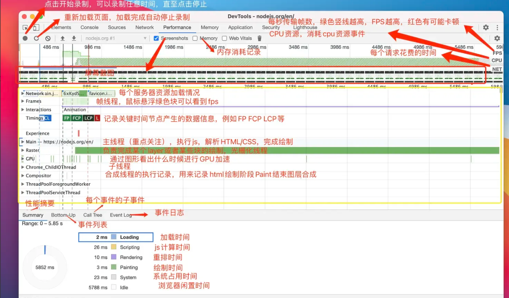

### 1. 角色权限管理怎么实现的

1. RBAC

每个角色都有自己的权限路由列表，公共的路由为静态路由，每个角色独有的为动态路由。在用户登录成功时，后端通过角色的信息返回改角色用友的权限列表。 前端通过深度遍历，用前端的全量路由和后端返回的路由进行路径匹配，如果path相同，则保留。path不同，将组件替换为NoAcess 无权限页面。最后和静态路由进行拼接得到完整的路由表。最后通过react-router中Route组件进行渲染。

### 2. 怎么将权限控制精确到 button 级别的

在登录成功的时候，后端返回一个权限点列表，每个权限点和页面，在前端通过封装一个usePremission方法，该方法接受一个权限点name，判断该name在不在后端返回的权限列表中，如果存在就返回true，不存在就返回false，接着通过三元表达式判断组件是否渲染。

### 3. 那你还了解其他的权限控制方案吗

基于用户的权限控制

### 4. 基于用户和基于角色权限控制之间的区别是什么

基于用户的权限控制： 当用户数量过多，配置修改繁琐，不灵活。适用于小型应用。

基于角色权限控制：通过角色进行中转，更加灵活，适合大型项目

### 5. 抽帧预览功能怎么实现的

创建video标签，监听video标签的loaddata事件，表示当前视频资源已经加载完成，可以通过设置video.currentTime对视频进行跳转。跳转完成之后触发seek事件，在seek事件中创建一个canvas标签，通过canvas.drawImage方法会自动获取可绘制图片，通过toDataURl导出base64，最终通过img标签展示。


### 6. 获取到的视频的那一帧的图片是什么格式的

seek事件后获取到的是video标签，类型[HTMLVideoElement](https://developer.mozilla.org/zh-CN/docs/Web/API/HTMLVideoElement)，通过canvas.drawImage方法会自动获取可绘制图片，通过toDataURl导出base64

### 7. JSON Schema数据之间的联动

我们使用formily的拓展属性x-reaction进行数据之间的联动，在x-reaction中配置dependcies字段和fulfill字段进行配置，表示当前这个字段被dep中的字段依赖，当dependicies中的字段发生变化的时候会改变当前字段的隐藏，交互状态。

比如我们的审核平台中type字段会联动一个tag选择器字段，reason字段。

### 8. 事件之间的联动

在x-commponetn-props中

事件之间的联动可以通过formily身上的creatform，返回一个form表单实例对象，通过query方法，接受一个参数，传递其他的表单项目的名字，这样就可以操作其他的表单项。

### 8. Websocket 的心跳机制和双向通信

websocket是基于TCP的长连接，如果客户端因为某些原因断开了连接，比如电脑休眠、断网。服务端会认为客户端依旧保持正常连接，会正常发送消息，导致服务器资源浪费。

心跳机制就是客户端每隔一段时间发送ping，服务端接收后发送一个pong作为回应，如果

### 9. ws 和 http 的区别

1. http是短连接，1.1通过connection： keep-alice可以实现长连接。 ws是长连接
2. http是单工通信协议，可以通过 长轮询和短轮询来模拟双向通讯，但性能消耗大。ws是全双工通讯协议，客户端和服务端可以互相发送消息。
3. http每次请求都带大量 Header（Cookie等），开销小。ws建立连接后，数据帧头部非常精简。

### 10. 私聊和群聊的实现方案

消息推送是通过onmessage事件实现的，当服务端通过websocket发送消息的时候，客户端会根据data.type进入不同的分支。

**私聊**

如果接受消息的类型是user ，表示是私聊

私聊会在服务端维护一个Map对象，每次发送消息的时候检查用户是否在线，在线则进行推送，如果不在线存入离校消息库中。

**群聊**

如果接受消息的类型是group，表示是私聊

不需要为每个用户写数据表，只需要一张表记录所有的聊天记录，服务端通过websocket向所有在线的用户进行发放。

如果是离线的用户，前端在下一次上线的时候会带上一个id向后端发起请求，表示收到的最后一条消息，后端对消息进行补发。

### 11. 下线之后怎么去接收消息 —— 下一次上线再去接收消息

### 12. 下线时的消息是存到哪的呢

存到数据库

### 13. 怎么判断上线下线的状态呢

**上线判断**

客户端发起请求，创建websocket示例，在成功连接的时候触发onopen事件，此时客户端会发送一个 消息，消息的格式为{type=opening，token，lastMsgID} ，服务端对token进行校验，并收到客户端发送的开场消息，会发送一条消息表示校验身份成功， 客户端收到消息，开启心跳包表示已经上线。

**下线判断**

用户点击退出的时候，触发oncloese方法，断开websocket连接。

网络原因 触发了offline事件，先进行一定次数的断线重连，如果重连失败，触发onclose方法。

心跳监测，服务端或者客户端长时间收不到心跳包，并且重连失败，表示下线。

### 14. token的原理

http是无状态请求，每一次请求到服务端都是全新的，服务端不能记住上一次的用户身份。

token就是一串经服务端生成的字符串。常见的类型就是通过jwt生成。jwt分成三个部分header，paylod和签名。header用于声明类型和支持的算法，paylod存放了一些用户的不敏感信息，签名是基于header和payload使用服务端的私钥进行加密而来。

在用户登录第一次的时候，前端发送用户名和密码，服务端对用户名和密码进行校验，校验成功后根据用户信息生成token，分发到前端，前端存储在本地，下次请求的时候前端将token放入自定义请求头中，服务端校验身份。


文档数字化：

1. 性能优化：https://www.yuque.com/u29297079/51-644/fnmce7t15x9boeve

### 15.性能优化做了哪些工作

在项目进行演示的时候，反馈页面首屏加载太慢，我通过performce面板进行分析，发现FCP指数在2.9s，




### 16.哪些常见的性能指标

FCP 从页面开始到加载的时间

LCP 从页面开始渲染出最大的内容元素的时间点

FMP 从页面开始加载到页面主要内容完成渲染的时间

TTL 从页面开始加载到页面可监护的时间，反映了用户完全能使用页面的时间

CLS 页面元素在加载过程中发生的布局的偏移总量，反应了页面布局的稳定性。


### 17.还有哪些常见的性能优化手段

针对FCP，LCP，FMP通用的地方就是都需要去进行静态资源的额加载，所以先针对静态资源进行优化 

**网络优化**

1. 连接简历可以分为DNS查询和TCP连接两个步骤

DNS查询可以通过DNS Prefetch进行优化

```
<link rel="dns-prefetch" href="//img.example.com">
```


preConnect 进行提前连接

```
<link rel="preconnect" href="//img.example.com">
```

2. 开启http2协议

http1.1 最多建立6个连接，会造成对头阻塞。

http2.0 只在一个tcp连接中进行复用，将消息中分解成独立的帧

3. 针对html/css/js等资源的加载耗时


html 

- 开启gzip压缩
- 减少白屏时间，骨架屏，ssg静态内容渲染


css

js 

- 减少体积

  JS 的 **chunk 拆分**和 CSS 一样都可以使用 Webpack 来实现，但是 Webpack 5 已经内置了 **splitChunks** 的配置：`splitChunks`。

  默认的配置对于大部分项目已经足够用了，如果有特殊需求可以自己覆盖配置：

  - 新 bundle 被**两个及以上**模块引用，或者来自 `node_modules`。
  - 新 bundle **大于 30kb**（压缩之前）。
  - 异步加载并并发加载的 bundle 数**不能大于 5 个**。
  - 初始加载的 bundle 数**不能大于 3 个**。

- 使用treeshkaing删除不必要的代码

- gzip


1. 流式输出：https://www.yuque.com/u29297079/51-644/whne2qocay03gi97
2. 对接的 coze ai，还了解过其他的一些前端 ai 库吗  —— vercel 的 ai-sdk
3. 大文件上传:https://www.yuque.com/u29297079/51-644/bimlee9pc3u8hb2g
4. 了解过 RAG 这个知识点吗：[https://hello-agents.datawhale.cc/#/./chapter8/%E7%AC%AC%E5%85%AB%E7%AB%A0%20%E8%AE%B0%E5%BF%86%E4%B8%8E%E6%A3%80%E7%B4%A2?id=_83-rag%e7%b3%bb%e7%bb%9f%ef%bc%9a%e7%9f%a5%e8%af%86%e6%a3%80%e7%b4%a2%e5%a2%9e%e5%bc%ba](https://hello-agents.datawhale.cc/#/./chapter8/第八章 记忆与检索?id=_83-rag系统：知识检索增强)

5. 实现的步骤
6. 有哪些优化措施