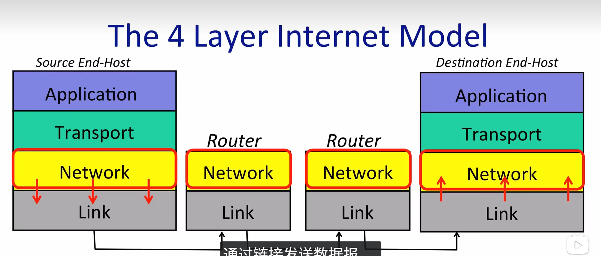
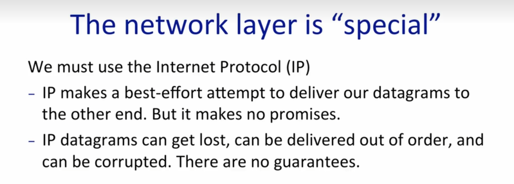
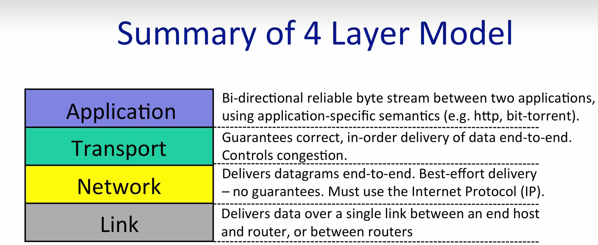
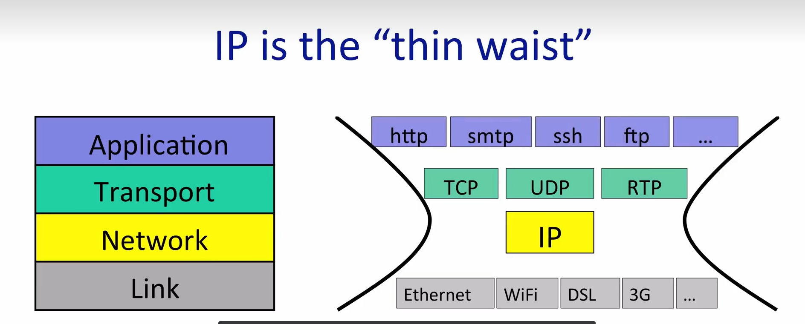

## 网络层

封装数据包，标记 **收件ip**和**发送ip**，交给链路层，

## Link

将网络层达到的数据包，通过链路，发送到目的地

## 网络层的特殊？

要想把一个数据发送到internet，必须使用ip协议

## 传输层

提供可靠的传输，TCP，UDP...

**应用层**

在两个应用程序之间提供**双向的、可靠的字节流**。它使用特定于应用程序的**语义**（例如：HTTP 协议用于网页，BitTorrent 用于下载）。

**传输层**

保证数据在端到端之间**正确、按顺序**地交付。同时负责**控制控制拥塞**（防止网络堵塞）。

**网络层**

 负责将数据报（Datagrams）实现**端到端**的交付。但这只是**尽力而为**的交付——没有任何保证。**必须使用**互联网协议（IP）

**链路层**

 在**单条链路**上传输数据。无论是主机与路由器之间，还是路由器与路由器之间。

